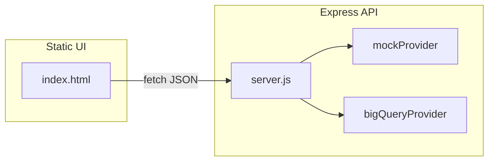
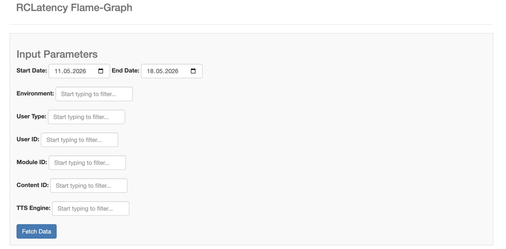
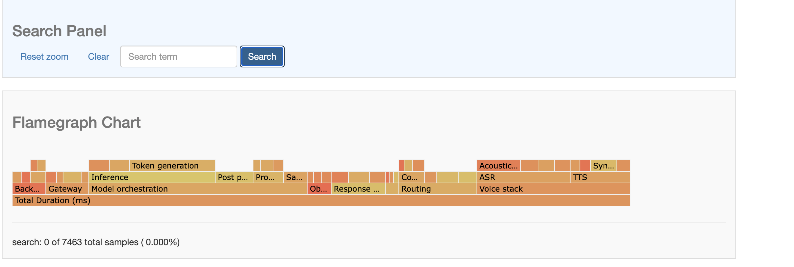
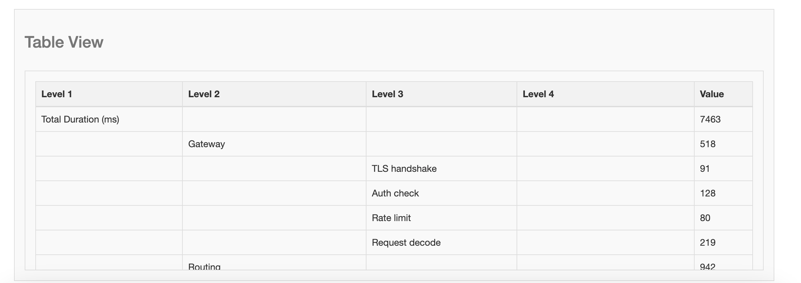

# Flamegraph Analytics — Performance Explorer

Interactive demo that turns multi-stage processing breakdowns into a
[D3 flame graph](https://github.com/spiermar/d3-flame-graph). **Mock data runs by
default** so anyone can clone and explore without cloud credentials. An optional
**BigQuery** backend remains available for private deployments.

**Saved UI capture:** open [`screenshots/Flamegraph-Analytics.htm`](screenshots/Flamegraph-Analytics.htm)
in a browser for a frozen snapshot of the interface (exported from an earlier local run).

## What It Demonstrates

- Visual drill-down into nested processing pipelines (routing, voice stack, model time).
- REST API contract stable for the vanilla JS client (`/fetch-filters`, `/fetch-data`).
- Clear separation between **demo data generation** and **warehouse-backed** mode.

## Architecture



| Component | Role |
|-----------|------|
| [`local/index.html`](local/index.html) | Bootstrap form + D3 flame graph + filter helpers |
| [`local/server.js`](local/server.js) | Express server, CORS, optional API key gate |
| [`local/lib/mockProvider.js`](local/lib/mockProvider.js) | Deterministic synthetic sessions + stats trees |
| [`local/lib/bigQueryProvider.js`](local/lib/bigQueryProvider.js) | Parameterized SQL against configurable tables |
| [`local/lib/config.js`](local/lib/config.js) | Reads `DATA_SOURCE`, ports, table IDs |

## Quick Start (Mock Mode — Recommended)

Requirements: **Node.js 18+** and **Python 3** (for the static file server).

```bash
git clone <your-fork-or-repo-url>
cd FlamegraphAnalytics

# Install API dependencies
npm install --prefix local

# Terminal A — API (loads ./local/.env if present)
npm start
# listens on http://localhost:3000 by default

# Terminal B — static UI
cd local && python3 -m http.server 8000
```

Visit `http://localhost:8000`, submit an empty API key when prompted (mock mode
always skips API-key validation), pick dates/filters, then submit the form to
render the flame graph.

## Tests

Run the unit and API integration tests from the repository root:

```bash
npm test
```

The suite covers mock data shape/filtering, config parsing, API key behavior, and
the mock `/fetch-filters` and `/fetch-data` endpoints.

### Configure API URL From the Browser

Set the `<meta name="api-base-url">` tag inside [`local/index.html`](local/index.html)
when hosting the UI somewhere other than `localhost:8000` talking to `localhost:3000`.

## Environment Variables

Copy [`local/.env.example`](local/.env.example) to `local/.env` and adjust.

To run the API **without** loading any `.env` file (fully open demo auth), start Node with
`DOTENV_CONFIG_PATH` pointing at a non-existent path, for example:

```bash
DOTENV_CONFIG_PATH=/nonexistent npm start
```

| Variable | Purpose |
|----------|---------|
| `DATA_SOURCE` | `mock` (default) or `bigquery` |
| `PORT` | API port (default `3000`) |
| `API_KEY` | Optional shared secret; enables `x-api-key` checks |
| `CORS_ORIGIN` | Allowed UI origin(s), comma-separated |
| `BIGQUERY_*` | Fully-qualified BigQuery tables + optional credentials |

When `API_KEY` is **unset**, the API intentionally skips header validation so you
can try the UI quickly. Set `API_KEY` before exposing anything on the public
internet.

## Optional BigQuery Mode

1. Provision tables compatible with the shapes referenced in
   [`local/lib/bigQueryProvider.js`](local/lib/bigQueryProvider.js): session metadata,
   processing event rows with nested **`latency_payload`** (event id, `flow_info`, processing flags,
   optional `stats_string` at row scope), **TTS metrics** rows joined on `session_id`,
   **ASR metrics** rows, and enriched sessions exposing `session_start_timestamp` (plus
   `user_id` / `session_id` for joins).
2. Populate every `BIGQUERY_TABLE_*` variable in `.env`.
3. Provide credentials via `BIGQUERY_KEY_FILE` **or** Application Default Credentials.
4. Set `DATA_SOURCE=bigquery` and restart the API.

Use BigQuery views if your warehouse uses different nested names but you want this SQL
to stay stable.

## API Endpoints

Both endpoints accept optional multi-value query params by repeating keys
(`environment=DEV&environment=PROD`).

| Method | Path | Description |
|--------|------|-------------|
| `GET` | `/fetch-filters` | Distinct filter values for the current date window |
| `GET` | `/fetch-data` | Rows shaped as `{ stats: { name, pipeline, total_value } }` |

## Screenshots & Saved HTML

- [`screenshots/Flamegraph-Analytics.htm`](screenshots/Flamegraph-Analytics.htm) —
  offline snapshot when you cannot host the demo live.

### Mock Data Flame Graph Snapshots







## Highlight reel

- Summarized complex processing JSON into a hierarchical flame graph for faster root-cause analysis.
- Mock-friendly backend so others can run the project locally without warehouse access.
- Optional reconnect to real datasets purely through configuration.

## Security Notes

- Never commit `.env` files, API keys, or service-account JSON.
- Rotate any credentials that were previously checked into git before publishing.

## License

MIT — see [LICENSE](LICENSE).
